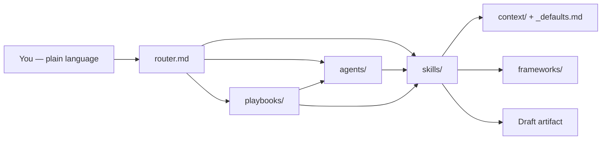

<p align="center">
  <h1 align="center">Pro PM</h1>
  <p align="center"><strong>The Product Manager Operating System</strong></p>
  <p align="center">Turn any AI assistant into a senior PM partner — in plain English, on day one.</p>
</p>

<p align="center">
  <a href="https://github.com/rahulgoyal1001/Pro-PM"></a>
  <a href="#install-and-run-your-harness"></a>
  <a href="LICENSE"></a>
  
  
  
  
</p>

---

## Table of contents

- [What is Pro PM?](#what-is-pro-pm)
- [Why Pro PM exists](#why-pro-pm-exists)
- [What changes for you](#what-changes-for-you)
- [What is inside](#what-is-inside)
- [How it works](#how-it-works)
- [Zero friction by design](#zero-friction-by-design)
- [Install and run (your harness)](#install-and-run-your-harness)
- [Your first hour](#your-first-hour)
- [Directory structure](#directory-structure)
- [Agents, playbooks, and skills](#agents-playbooks-and-skills)
- [Enterprise deployment](#enterprise-deployment)
- [Documentation map](#documentation-map)
- [Contributing](#contributing)
- [License](#license)

---

## What is Pro PM?

**Pro PM** is an open-source **operating system for product managers** that runs on top of the AI tools you already use — Cursor, Claude Code, OpenAI Codex, Windsurf, GitHub Copilot, Continue, Cline, Aider, ChatGPT, or your own API.

It is not another chatbot prompt. It is a **structured harness**: hundreds of skills, agents, playbooks, frameworks, templates, and optional company context — all wired together so the AI **behaves like a strong senior PM** instead of a generic writer.

You talk in normal language:

> *"Write a PRD for SSO for enterprise admins."*  
> *"Prep me for a roadmap review with my VP."*  
> *"Run quarterly planning for the platform team."*

Pro PM **figures out what to run** (agent, playbook, or skill), **applies the right framework**, **uses your context when you have it**, and **ships a draft-ready artifact** — without you memorizing commands or filling long forms first.

**One folder (`pro-pm/`), one brain (`system-prompt.md` + `router.md`), every harness.** Adapters only explain *where* your IDE loads those files — not different PM logic per vendor.

Works for **B2B, B2C, B2B2B, B2B2C** — any industry, stage, and team size.

---

## Why Pro PM exists

### The PM time trap

Strong PMs are judged on judgment: customer insight, strategy, tradeoffs, alignment, narrative. Yet most weeks disappear into:

- Rewriting the same PRD sections from scratch  
- Hunting for the “right” prioritization or strategy framework  
- Rebuilding exec updates, launch checklists, and stakeholder emails  
- Re-explaining your product and company to a generic AI every session  

High-leverage work gets whatever time is left after the document treadmill.

### The generic AI gap

A general model can write *a* PRD. It cannot reliably:

- Match how **your** company stages deals, measures success, or speaks to leadership  
- Pick **RICE vs JTBD vs Van Westendorp** for *this* decision without you steering  
- Run a **multi-step launch** or **quarterly planning** process in order  
- Pressure-test a plan from **engineering, sales, finance, and customer success** angles  

You become the router, the template library, and the quality bar — every time.

### What Pro PM adds

Pro PM gives your AI:

| Layer | What it does |
|-------|----------------|
| **Router** | Maps your words → agent, playbook, or skill |
| **Skills (328)** | Step-by-step instructions for one deliverable (PRD, battlecard, OKR set, …) |
| **Agents (20)** | Multi-step reasoning (strategy, research, launch, pricing, …) |
| **Playbooks (23)** | End-to-end flows (launch, quarterly planning, PMF search, incident, …) |
| **Frameworks (107)** | Applied automatically when relevant |
| **Personas (42)** | Cross-functional lenses on decisions and comms |
| **Templates (62)** | Production-shaped scaffolds |
| **Context (optional)** | You, company, products, people, tools — progressive, never required day one |
| **Defaults** | Sensible assumptions so work starts immediately |

You stay the PM. Pro PM is the **staff, process, and institutional memory** your AI was missing.

---

## What changes for you

| Before | With Pro PM |
|--------|-------------|
| "Write a PRD" → generic template | Structured PRD with problem, metrics, scope, risks — skill + template + framework |
| You choose frameworks from memory | Router + frameworks/ pick the fit and show the work |
| Blank page on launch planning | `playbooks/product-launch.md` phases with real agents/skills |
| Re-paste company context every chat | Optional `context/` — loaded when present, defaults when empty |
| Different prompts per tool | Same `pro-pm/` in Cursor, Codex, Claude Code, Windsurf, … |

**Motivation in one line:** Pro PM is the difference between *using AI for PM tasks* and *having an AI that already knows how great PM work is done*.

---

## What is inside

| Component | Count | Location |
|-----------|------:|----------|
| **Skills** | 328 | `skills/` — discover, define, plan, execute, launch, measure, communicate, strategy, people, operate, ai-pm, collateral, tools |
| **Agents** | 20 | `agents/` — spec writer, research, launch, pricing, comms, … |
| **Playbooks** | 23 | `playbooks/` — launch, quarterly planning, PMF, incident, … |
| **Frameworks** | 107 | `frameworks/` — strategy, prioritization, discovery, growth, pricing, … |
| **Personas** | 42 | `personas/` — engineering, design, sales, leadership, … |
| **Templates** | 62 | `templates/` — PRDs, decks, updates, collateral |
| **Integration guides** | 68 | `context/integrations/` — Jira, Slack, Figma, Gmail, M365, … (optional, no API keys in repo) |
| **Rules** | 16 | `rules/` — zero-friction, security, platform-agnostic, … |

**Core brain (always):** `system-prompt.md` · `router.md` · `context/_defaults.md` · `skills/_GLOBAL-BEHAVIOR.md`

---

## How it works



1. **You ask** — no syntax, no skill IDs.  
2. **Router** chooses Agent (complex) > Playbook (phased) > Skill (single artifact).  
3. **Context** loads if you filled it; otherwise `_defaults.md`.  
4. **Skill / agent / playbook** runs with frameworks and templates.  
5. **You get** a complete draft, labeled assumptions, optional sharpen footer.

Details: [`HARNESS.md`](HARNESS.md)

---

## Zero friction by design

Pro PM is built so **starting is easier than not starting**:

- **No setup gate** — empty `context/` is normal.  
- **Ship first** — full draft on the first response.  
- **One question max** — only when the ask is truly ambiguous.  
- **No API keys in markdown** — integrations are preferences, not blockers.  
- **Labeled assumptions** — `[Assumption: …]` so you can correct inline.  
- **Progressive profiling** — add role, company, product, people when you see value.

Rules: [`rules/zero-friction.md`](rules/zero-friction.md) · Onboarding: [`context/START-HERE.md`](context/START-HERE.md)

---

## Install and run (your harness)

> **First time installing?** **[`../README.md`](../README.md)** — download, wire Cursor/Claude Code/Codex (required). The local webpage in `pro-pm-console/` is optional.

### 60-second path (every platform)

1. Put `pro-pm/` in your workspace (clone this repo or copy the folder).  
2. Attach **three files** to your tool’s project instructions:  
   - `pro-pm/system-prompt.md`  
   - `pro-pm/router.md`  
   - (behavior) `pro-pm/context/_defaults.md` via the universal block below  
3. Ask anything in plain language.

**Universal block** — paste into `.cursorrules`, `CLAUDE.md`, root `AGENTS.md`, Copilot instructions, etc.:

```markdown
## Pro PM
This workspace includes Pro PM at `pro-pm/`.
- Follow `pro-pm/system-prompt.md` and `pro-pm/router.md` for all product management work.
- Use `pro-pm/context/_defaults.md` when context files are empty.
- Deliver complete drafts first; at most one clarifying question.
```

**Step-by-step install (all platforms):** [`INSTALL.md`](INSTALL.md)

### Choose your harness

| If you use… | Follow this guide |
|-------------|-------------------|
| **Not sure / any tool** | [`platform-adapters/universal-setup.md`](platform-adapters/universal-setup.md) |
| **Cursor** | [`platform-adapters/cursor.md`](platform-adapters/cursor.md) |
| **Claude Code** | [`platform-adapters/claude-code.md`](platform-adapters/claude-code.md) |
| **OpenAI Codex** | [`platform-adapters/codex.md`](platform-adapters/codex.md) + root `AGENTS.md` snippet |
| **Windsurf** | [`platform-adapters/windsurf.md`](platform-adapters/windsurf.md) |
| **ChatGPT / Gemini / web** | [`platform-adapters/generic-llm.md`](platform-adapters/generic-llm.md) |
| **Copilot, Continue, Cline, Aider, …** | [`platform-adapters/other-harnesses.md`](platform-adapters/other-harnesses.md) |

**Codex / AGENTS.md users:** [`platform-adapters/repo-root-AGENTS.snippet.md`](platform-adapters/repo-root-AGENTS.snippet.md) · Portable brief: [`AGENTS.md`](AGENTS.md)

**Adapter index:** [`platform-adapters/README.md`](platform-adapters/README.md)

### Verify install

Ask once:

| Prompt | Should invoke |
|--------|----------------|
| Write a PRD for [feature] | `skills/define/write-prd.md` + PRD template |
| Run quarterly planning | `playbooks/quarterly-planning.md` |
| Draft a weekly update for leadership | `skills/communicate/weekly-update.md` |

If the model interrogates you with long forms first, re-wire `system-prompt.md` and `router.md`.

---

## Your first hour

| Minute | Do this |
|--------|---------|
| 0–5 | Install per [`INSTALL.md`](INSTALL.md) for your harness |
| 5–10 | Run the three verify prompts above |
| 10–20 | Real task: PRD, meeting prep, or status update you need this week |
| 20–30 | Optional: 2 lines in `context/me/profile.md` + `context/company/overview.md` |
| 30–60 | Optional: copy `context/products/_template/` → your product; skim [`agents/README.md`](agents/README.md) |

You do not need to read 328 skills. The router and your words are enough.

---

## Directory structure

```
pro-pm/
├── INSTALL.md                 # Install & run (start here for wiring)
├── README.md                  # This file
├── HARNESS.md                 # How components connect
├── AGENTS.md                  # Portable brief for Codex / root AGENTS.md
├── system-prompt.md           # PM identity & behavior (required)
├── router.md                  # Auto-routing (required)
│
├── context/                   # Optional personalization
│   ├── START-HERE.md
│   ├── _defaults.md           # Built-in assumptions (required behavior)
│   ├── CONTEXT-MAP.md
│   ├── me/ company/ products/ people/ team/ initiatives/
│   └── integrations/          # 68 tool guides (optional)
│
├── skills/                    # 328 skills
│   ├── _GLOBAL-BEHAVIOR.md
│   ├── _ROUTER-ALIASES.md
│   ├── discover/ define/ plan/ execute/ launch/ measure/
│   ├── communicate/ strategy/ people/ operate/ ai-pm/
│   ├── collateral/ tools/ brainstorm-partner.md
│
├── agents/                    # 20 agents + README.md
├── playbooks/                 # 23 end-to-end workflows
├── frameworks/                # 107 frameworks
├── personas/                  # 42 perspectives
├── templates/                 # 62 templates
├── rules/                     # 16 operating rules
├── platform-adapters/         # Per-harness wiring (not different logic)
└── artifacts/                 # Your generated outputs (gitignored)
```

---

## Agents, playbooks, and skills

### Agents (20)

Autonomous co-pilots for multi-step work. **Catalog:** [`agents/README.md`](agents/README.md)

Examples: **Spec Writer** (PRDs), **Research Analyst**, **Launch Coordinator**, **Quarterly Planner**, **Pricing & Packaging Advisor**, **Comms Chameleon**, **Advisory Board** (cross-functional review).

### Playbooks (23)

Phased workflows — readiness, GTM, post-launch, etc. Examples:

| Playbook | When to use |
|----------|-------------|
| `product-launch.md` | GA / major launch |
| `quarterly-planning.md` | OKRs + roadmap cycle |
| `new-feature-lifecycle.md` | Idea → launch → measure |
| `product-market-fit-search.md` | PMF exploration |
| `incident-response.md` | Product incidents |
| `pricing-packaging-change.md` | Pricing change program |

Say: *"Guide me through the product launch playbook"* — router loads the file.

### Skills (328)

Single-artifact tasks. Examples: `define/write-prd`, `communicate/exec-summary`, `plan/quarterly-okrs`, `discover/competitive-analysis`, `tools/project-management/jira-ticket-writer`.

**You never call these by name.** Router + Auto-Trigger Patterns in each file handle selection.

---

## Key features

| Feature | Description |
|---------|-------------|
| **Harness-agnostic** | Same Pro PM in Cursor, Claude Code, Codex, Windsurf, Copilot, web LLMs, API |
| **Zero friction** | Day-one drafts; `_defaults.md`; one clarifying question max |
| **Integrated routing** | `router.md` + `_ROUTER-ALIASES.md` aligned to real skill files |
| **328 skills** | Full PM lifecycle + collateral + tool-specific outputs |
| **20 agents** | Multi-step domains (strategy, spec, launch, data, people, …) |
| **23 playbooks** | Repeatable programs with correct agent/skill phases |
| **107 frameworks** | Auto-selected and applied with rationale |
| **42 personas** | Engineering, design, sales, leadership, customer-facing, … |
| **68 integration guides** | Jira, Confluence, Slack, Figma, Google Workspace, M365, … |
| **4P foundation** | People, Product, Price, Packaging on significant decisions |
| **Stakeholder intelligence** | `context/people/` — personas from LinkedIn, interactions, org |
| **Security-aware** | No credentials in repo; rules for safe context and MCP |
| **Open source** | Apache 2.0 — fork, extend, enterprise deploy |

---

## Enterprise deployment

**Shared (org):** `context/company/`, `frameworks/`, `templates/`, `rules/`  
**Personal (per PM):** `context/me/`, `context/products/`, `context/people/`, `artifacts/`

Deploy shared layer via submodule, internal package, or shared drive. Each PM keeps their context and outputs local.

---

## Documentation map

| Document | Audience |
|----------|----------|
| [`INSTALL.md`](INSTALL.md) | Anyone installing |
| [`README.md`](README.md) | First-time overview (this file) |
| [`HARNESS.md`](HARNESS.md) | How wiring works |
| [`context/START-HERE.md`](context/START-HERE.md) | Personalization |
| [`agents/README.md`](agents/README.md) | Agent catalog |
| [`platform-adapters/`](platform-adapters/) | Per-IDE setup |
| [`skills/_ROUTER-ALIASES.md`](skills/_ROUTER-ALIASES.md) | Path resolution |
| [`context/CONTEXT-MAP.md`](context/CONTEXT-MAP.md) | Context paths |

---

## Contributing

Contributions welcome: skills, frameworks, personas, templates, playbooks, adapters.

1. Match existing markdown patterns and quality bar.  
2. Plain Markdown only — no proprietary formats.  
3. Skills must honor `_GLOBAL-BEHAVIOR.md` and zero-friction.  
4. Router paths must match real files (or add alias in `_ROUTER-ALIASES.md`).  
5. Test with at least one harness (filesystem + paste).

---

## License

Apache License 2.0 — see [LICENSE](LICENSE).

---

<p align="center">
  <strong>You already do the hard PM thinking. Pro PM removes the busywork between you and that thinking.</strong><br>
  Copy <code>pro-pm/</code> → wire your harness → ask for what you need.
</p>

<p align="center">
  <a href="INSTALL.md"><strong>Install now →</strong></a>
</p>
