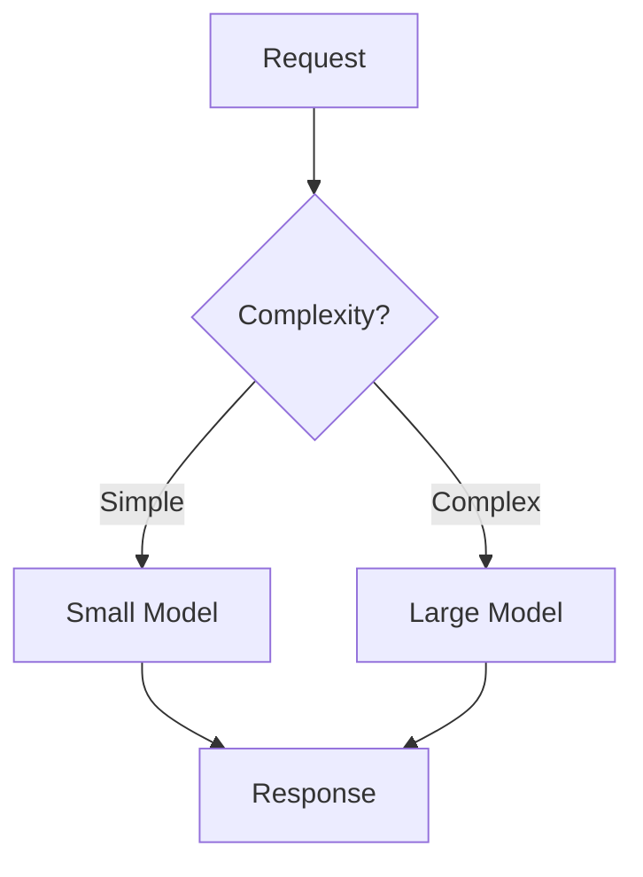

# AI Cost Optimization

## Purpose
Optimize the costs of AI-powered features across the full stack: model selection (capability vs cost trade-offs), caching strategies, prompt optimization, request batching, model distillation options, usage monitoring, and budget forecasting. Help PMs make informed decisions about where to invest in AI quality and where to economize.

## Auto-Trigger Patterns
- "AI costs are too high"
- "Optimize AI spending"
- "Reduce LLM costs"
- "AI cost optimization"
- "Budget for AI feature"
- "How to reduce inference costs"
- "Model cost comparison"

## Inputs

**Zero-setup:** Only the user prompt is required. If context files are empty, use `context/_defaults.md` and label assumptions. See `skills/_GLOBAL-BEHAVIOR.md`.

- **Current AI usage** (required) — models used, request volume, cost breakdown
- **Feature requirements** (required) — quality needs, latency constraints, output type
- **Budget** (optional) — available budget, cost targets
- **Growth projections** (optional) — expected volume growth
- **Quality baselines** (required) — current quality metrics to maintain during optimization

## Process
1. **Audit current costs** — break down costs by model, feature, request type, and volume
2. **Model selection optimization** — evaluate whether a cheaper model can meet quality requirements:
   - Map tasks to minimum-viable model capability
   - Test smaller/cheaper models on eval dataset
   - Consider routing: easy tasks → cheap model, hard tasks → expensive model
3. **Prompt optimization** — reduce token usage:
   - Shorten system prompts without losing quality
   - Optimize few-shot examples (fewer, better)
   - Reduce output token requirements
4. **Caching strategies** — avoid redundant inference:
   - Semantic caching for similar queries
   - Exact-match caching for repeated requests
   - Pre-computation for predictable queries
5. **Batching** — group requests for efficiency
6. **Model distillation** — train a smaller model on larger model's outputs
7. **Usage monitoring** — track and alert on cost anomalies
8. **Budget forecasting** — project costs at different growth scenarios

## Output Format
```markdown
# AI Cost Optimization: [Feature/Product]
**Current monthly spend**: $X | **Target**: $X | **Potential savings**: XX%

## Current Cost Breakdown
| Model | Feature | Requests/Month | Avg Tokens | Cost/Request | Monthly Cost |
|-------|---------|---------------|-----------|-------------|-------------|

## Optimization Opportunities (Prioritized)

### 1. Model Selection Optimization
| Task | Current Model | Proposed Model | Quality Impact | Cost Savings |
|------|-------------|---------------|---------------|-------------|
| [Task] | GPT-4 | GPT-4o-mini | <2% quality drop | -70% |

#### Model Routing Strategy


### 2. Prompt Optimization
| Prompt | Current Tokens | Optimized Tokens | Savings |
|--------|--------------|-----------------|---------|
| System prompt | X | Y | Z% |

### 3. Caching Strategy
| Cache Type | Hit Rate (est.) | Requests Saved | Monthly Savings |
|-----------|----------------|---------------|----------------|
| Exact match | 15% | X | $X |
| Semantic | 25% | X | $X |

### 4. Batching Opportunities
| Batch Type | Current | Batched | Savings |
|-----------|---------|--------|---------|

### 5. Model Distillation (if applicable)
- **Training cost**: $X (one-time)
- **Inference savings**: $X/month
- **Break-even**: X months
- **Quality trade-off**: …

## Savings Summary
| Optimization | Monthly Savings | Effort | Quality Risk |
|-------------|----------------|--------|-------------|
| Model routing | $X | Medium | Low |
| Prompt optimization | $X | Low | None |
| Caching | $X | Medium | None |
| **Total** | **$X (XX%)** | | |

## Budget Forecast
| Scenario | 3 Months | 6 Months | 12 Months |
|----------|----------|----------|-----------|
| Current trajectory | $X | $X | $X |
| After optimization | $X | $X | $X |
| 2x volume growth | $X | $X | $X |
| 5x volume growth | $X | $X | $X |

## Monitoring & Alerts
| Metric | Threshold | Alert |
|--------|----------|-------|
| Daily spend | >$X | Slack alert |
| Cost per request | >$X | Dashboard flag |
| Cache hit rate | <X% | Review caching |

## Implementation Roadmap
### Week 1: Quick Wins (Prompt optimization)
### Week 2-3: Model routing
### Month 2: Caching implementation
### Month 3+: Distillation evaluation
```

## Quality Standards
- Optimizations are validated against quality baselines — savings don't sacrifice quality
- Model routing is based on actual eval results, not assumptions
- Caching estimates use realistic hit rates, not best-case scenarios
- Budget forecasts include volume growth scenarios
- **Anti-patterns**: Optimizing cost without measuring quality impact; assuming all requests need the best model; ignoring caching opportunities; no monitoring for cost anomalies

## Framework References
- AI cost modeling and optimization frameworks
- Caching architecture patterns for LLM applications
- Model distillation and knowledge transfer techniques
- Cloud cost optimization principles applied to AI

## Formatting Guidelines
- Cost breakdown table at top for current state clarity
- Savings summary with effort and quality risk assessment
- Budget forecast with multiple scenarios
- Implementation roadmap as phased approach

## Example
"Current: $3,200/month on GPT-4 for customer support responses. Optimization: Route simple FAQ responses (60% of volume) to GPT-4o-mini ($0.15/1M tokens vs $10/1M), saving $1,800/month. Add semantic caching for common questions (estimated 25% hit rate), saving $400/month. Shorten system prompt from 800 to 400 tokens, saving $300/month. Total savings: $2,500/month (78%) with <3% quality degradation validated on eval dataset."
