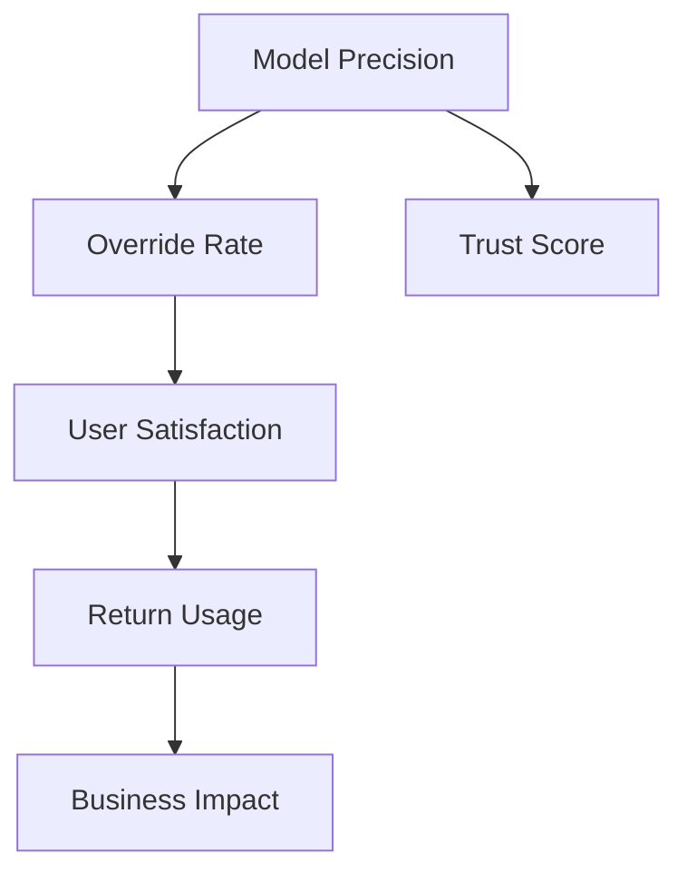

# AI Product Metrics

## Purpose
Define a comprehensive metrics framework for AI-powered features that spans model performance, user experience, business impact, and operational health. AI features need different metrics than traditional features — precision/recall matter, but so do user trust, fallback rates, and cost-per-inference. Build a metrics system that tells you whether the AI is actually helping users.

## Auto-Trigger Patterns
- "Metrics for AI feature"
- "How to measure AI success"
- "AI product metrics"
- "KPIs for ML feature"
- "Measure AI quality"
- "Success metrics for [AI capability]"

## Inputs

**Zero-setup:** Only the user prompt is required. If context files are empty, use `context/_defaults.md` and label assumptions. See `skills/_GLOBAL-BEHAVIOR.md`.

- **AI feature description** (required) — what the AI does, user interaction model
- **Feature spec** (optional) — from `ai-feature-spec` output
- **Business goals** (required) — what business outcome this feature should drive
- **Baseline data** (optional) — current metrics without AI (for comparison)
- **Monitoring tools** (optional) — what monitoring infrastructure is available

## Process
1. **Define model metrics** — performance of the AI model itself
2. **Define UX metrics** — how users experience and interact with the AI
3. **Define business metrics** — impact on business outcomes
4. **Define operational metrics** — system health, cost, reliability
5. **Define trust metrics** — user confidence in the AI
6. **Establish baselines** — current state without AI or with previous version
7. **Set targets** — for each metric, what constitutes success
8. **Design measurement plan** — how to collect, where to store, who monitors
9. **Create dashboard specification** — what to show, to whom, at what cadence

## Output Format
```markdown
# AI Metrics Framework: [Feature Name]
**Date**: … | **Baseline period**: …

## Metrics Hierarchy

### Tier 1: North Star
| Metric | Definition | Target | Current Baseline |
|--------|-----------|--------|-----------------|

### Tier 2: Model Performance
| Metric | Definition | Target | Min Viable | Measurement |
|--------|-----------|--------|-----------|------------|
| Precision | Correct positive / all predicted positive | 90% | 80% | Daily |
| Recall | Correct positive / all actual positive | 85% | 75% | Daily |
| F1 Score | Harmonic mean of precision & recall | 87% | 77% | Daily |
| Latency (P50/P95) | Response time | 200ms/500ms | 500ms/2s | Real-time |

### Tier 3: User Experience
| Metric | Definition | Target | Measurement |
|--------|-----------|--------|------------|
| Task completion rate | Users who complete task with AI | +20% vs baseline | Event tracking |
| Time saved | Time to complete task | -40% vs manual | Session analytics |
| User satisfaction (CSAT) | Post-interaction rating | 4.2/5 | In-product survey |
| Override rate | Users who correct AI output | <15% | Event tracking |
| Fallback rate | Times AI fails and user goes manual | <5% | Error tracking |
| Return usage | Users who use AI feature again | >60% at 7d | Cohort analysis |

### Tier 4: Business Impact
| Metric | Definition | Target | Measurement |
|--------|-----------|--------|------------|

### Tier 5: Operational
| Metric | Definition | Threshold | Alert |
|--------|-----------|----------|-------|
| Inference cost | Cost per request | <$0.XX | Budget exceeded |
| Error rate | Failed inferences | <1% | >2% for 5 min |
| Throughput | Requests per second | Supports Xrps | >80% capacity |
| Model freshness | Time since last update | <30 days | >45 days |

### Tier 6: Trust & Safety
| Metric | Definition | Target | Monitoring |
|--------|-----------|--------|-----------|
| Harmful output rate | Outputs flagged by safety | <0.01% | Real-time filter |
| Bias disparity | Performance gap across groups | <5% | Monthly audit |
| User trust score | "I trust this AI's suggestions" | >4/5 | Quarterly survey |

## Metric Relationships


## Measurement Plan
| Metric | Data Source | Collection Method | Frequency | Owner |
|--------|-----------|------------------|-----------|-------|

## Dashboard Specification
### Executive View
- [3-5 top-line metrics with trends]

### PM View
- [Model + UX + business metrics detail]

### Engineering View
- [Operational + model performance detail]

## Alerting Rules
| Metric | Warning | Critical | Action |
|--------|---------|---------|--------|
```

## Quality Standards
- Metrics cover all four tiers — model, UX, business, and operational
- Override rate and fallback rate are tracked — they measure real AI quality from user perspective
- Trust metrics are included — user confidence matters for AI adoption
- Targets are informed by baselines, not aspirational numbers
- **Anti-patterns**: Only measuring model accuracy without UX impact; no operational cost tracking; ignoring trust metrics; setting targets without baselines

## Framework References
- HEART framework adapted for AI (Happiness, Engagement, Adoption, Retention, Task success)
- Model evaluation methodology (precision, recall, F1, AUC)
- Operational ML monitoring best practices
- AI trust measurement research

## Formatting Guidelines
- Tiered metrics hierarchy from North Star to operational details
- Mermaid diagram for metric relationships
- Separate dashboard specs for different audiences
- Alerting rules with clear escalation

## Example
AI-powered search: "North Star: search success rate (user finds what they need). Model: MRR@10 = 0.75. UX: time-to-result -30% vs keyword search, CSAT 4.3/5, override rate (user reformulates) <20%. Business: support ticket deflection +15%. Operational: P95 latency <300ms, cost <$0.001/query. Trust: 'AI search gave me what I needed' >70% agreement. Alert: if precision drops below 70% for 1 hour, page on-call ML engineer."
