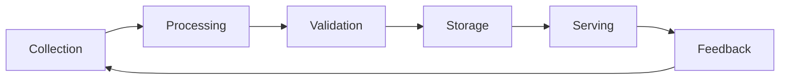

# Data Strategy

## Purpose
Design a comprehensive data strategy for AI features: data collection plan, labeling strategy, quality requirements, pipeline architecture, storage and privacy considerations, feedback loops, and continuous improvement mechanisms. Ensure the AI feature has the data foundation it needs to launch, learn, and improve over time.

## Auto-Trigger Patterns
- "Data strategy for AI feature"
- "What data do we need for…"
- "Data collection plan"
- "How to get training data"
- "Data pipeline for ML"
- "Labeling strategy"

## Inputs

**Zero-setup:** Only the user prompt is required. If context files are empty, use `context/_defaults.md` and label assumptions. See `skills/_GLOBAL-BEHAVIOR.md`.

- **AI feature description** (required) — what the AI feature does
- **Model approach** (required) — model type, training vs prompting, fine-tuning needs
- **Current data assets** (optional) — what data exists, format, quality, access
- **User base** (optional) — size, behavior patterns, data generation rate
- **Privacy requirements** (required) — regulations, consent model, data residency
- **Budget for data** (optional) — labeling budget, infrastructure budget

## Process
1. **Define data requirements** — what data the model needs for training and inference
2. **Audit existing data** — what's available, quality assessment, gaps
3. **Design collection plan** — how to acquire missing data (user interactions, synthetic, purchased, partnerships)
4. **Create labeling strategy** — human labeling, auto-labeling, active learning, crowd vs expert
5. **Define quality standards** — accuracy, completeness, freshness, consistency, representativeness
6. **Design pipeline architecture** — collection → processing → storage → serving → monitoring
7. **Address privacy and compliance** — consent, anonymization, retention, access controls
8. **Build feedback loops** — how user interactions improve the model over time
9. **Plan continuous improvement** — retraining cadence, data drift detection, quality monitoring

## Output Format
```markdown
# Data Strategy: [AI Feature Name]
**Date**: … | **Model type**: … | **Data maturity**: [Green/Yellow/Red]

## Data Requirements
| Data Type | Purpose | Volume Needed | Current State | Gap |
|-----------|---------|--------------|--------------|-----|

## Data Audit
### Available Data
| Source | Format | Volume | Quality | Labeled? | Access |
|--------|--------|--------|---------|----------|--------|

### Missing Data
| Data Needed | Acquisition Strategy | Timeline | Cost |
|------------|---------------------|---------|------|

## Collection Plan
### User-Generated Data
- What to collect: …
- Collection mechanism: …
- Consent approach: …

### Synthetic Data
- Generation approach: …
- Quality validation: …

### External Data
- Sources: …
- Licensing: …

## Labeling Strategy
| Approach | Use Case | Quality | Cost | Speed |
|----------|----------|---------|------|-------|
| Expert labeling | High-stakes categories | High | High | Slow |
| Crowd labeling | Volume tasks | Medium | Low | Fast |
| Auto-labeling | Pattern-based | Varies | Very Low | Immediate |
| Active learning | Edge cases | High | Medium | Medium |

### Labeling Quality Assurance
- Inter-annotator agreement target: …
- Review process: …
- Edge case handling: …

## Quality Standards
| Dimension | Standard | Measurement | Monitoring |
|-----------|---------|-------------|-----------|

## Pipeline Architecture


## Privacy & Compliance
| Requirement | Approach | Implementation |
|-------------|---------|---------------|

## Feedback Loops
### Implicit Feedback
- [User behavior signals: clicks, ignores, corrections]

### Explicit Feedback
- [Thumbs up/down, ratings, reported issues]

### Feedback → Improvement Pipeline
- Collection → Aggregation → Analysis → Model Update

## Continuous Improvement Plan
| Activity | Frequency | Trigger | Owner |
|----------|-----------|---------|-------|
| Retrain model | Monthly | Performance drop or data drift | ML team |
| Data quality audit | Quarterly | Scheduled | Data team |
| Bias audit | Quarterly | Scheduled + triggered | Ethics review |

## Risks & Mitigations
| Risk | Likelihood | Impact | Mitigation |
|------|-----------|--------|------------|
```

## Quality Standards
- Data requirements are specific and justified — not "collect everything"
- Labeling strategy balances quality, cost, and speed with clear rationale
- Privacy approach is proactive, not retrofit
- Feedback loops are designed into the product, not bolted on
- **Anti-patterns**: Assuming data quality without auditing; over-collecting without purpose; no labeling quality assurance; ignoring data drift; no feedback mechanism

## Framework References
- Data-centric AI methodology (Andrew Ng)
- Data mesh principles for pipeline architecture
- Privacy by Design framework
- Active learning strategies

## Formatting Guidelines
- Mermaid flowchart for pipeline architecture
- Tables for structured requirements and assessments
- Separate sections for collection, labeling, quality, and privacy
- Continuous improvement as ongoing plan, not one-time activity

## Example
For a sentiment analysis feature: "Data: need 10K labeled customer reviews across 5 sentiment categories. Available: 50K unlabeled reviews. Strategy: auto-label 80% using existing keyword rules, expert-label 20% edge cases, target 90% inter-annotator agreement. Feedback loop: users can correct sentiment classification, corrections feed into retraining dataset monthly. Privacy: anonymize all PII before labeling, retain labeled data for 2 years, consent obtained via ToS update."
