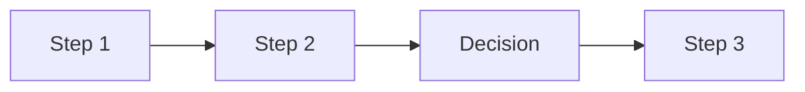
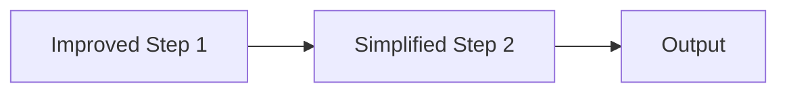

# Process Improvement

## Purpose
Diagnose an underperforming or painful PM/team process, identify root causes, design improvements, and plan a rollout with change management. Move from "this process is broken" complaints to structured analysis and measurable improvement — without disrupting ongoing work.

## Auto-Trigger Patterns
- "This process isn't working"
- "Improve our [process name]"
- "Process improvement for…"
- "Why is [process] so painful"
- "Fix our sprint planning / review / standup / intake…"
- "Redesign how we…"

## Inputs

**Zero-setup:** Only the user prompt is required. If context files are empty, use `context/_defaults.md` and label assumptions. See `skills/_GLOBAL-BEHAVIOR.md`.

- **Process to improve** (required) — which process and why it's a problem
- **Current state description** (required) — how it works today, who's involved, frequency
- **Pain points** (required) — what's not working, from whose perspective
- **Constraints** (optional) — organizational, tooling, political, or cultural constraints
- **Success vision** (optional) — what "good" looks like

## Process
1. **Map current state** — document the process as-is: steps, actors, inputs, outputs, timing, decision points
2. **Identify pain points** — categorize by type: too slow, too complex, unclear ownership, poor quality output, misaligned to goals
3. **Root cause analysis** — for each pain point, ask "why" 5 times to find systemic causes
4. **Benchmark** — what does good look like for this type of process (industry practices, framework recommendations)
5. **Design future state** — propose changes with clear rationale for each
6. **Define success metrics** — how to measure improvement
7. **Plan rollout** — phased approach with pilot, feedback, and iteration
8. **Change management** — who needs to buy in, communication plan, training needs

## Output Format
```markdown
# Process Improvement: [Process Name]
**Current state**: [Brief description]
**Problem statement**: [Specific, measurable problem]

## Current State Map


## Pain Point Analysis
| Pain Point | Who Feels It | Root Cause | Severity |
|-----------|-------------|-----------|---------|

## Root Cause Analysis
### Pain Point 1: [Name]
- Why? → …
- Why? → …
- Why? → [Root cause identified]

## Proposed Future State


### Changes & Rationale
| Change | Rationale | Risk | Mitigation |
|--------|----------|------|------------|

## Success Metrics
| Metric | Current | Target | Measurement Method |
|--------|---------|--------|-------------------|

## Rollout Plan
### Phase 1: Pilot (Week 1-2)
- Scope: [Limited rollout]
- Participants: [Who]
- Success criteria for proceeding: …

### Phase 2: Expand (Week 3-4)
### Phase 3: Full Adoption (Week 5+)

## Change Management
- **Stakeholder buy-in needed**: [who, approach]
- **Communication plan**: [how to announce, gather feedback]
- **Training**: [what's needed]
- **Feedback loops**: [how to iterate]
```

## Quality Standards
- Current state map is accurate and validated, not assumed
- Root causes are systemic, not surface-level symptoms
- Proposed changes include risk assessment and mitigation
- Rollout is phased with clear criteria for proceeding
- **Anti-patterns**: Redesigning without understanding current state; solving symptoms not causes; big-bang rollout without pilot; ignoring change management

## Framework References
- Lean process improvement (eliminate waste, value stream mapping)
- 5 Whys for root cause analysis
- PDCA (Plan-Do-Check-Act) cycle
- Kotter's change management (adapted for process changes)

## Formatting Guidelines
- Mermaid flowcharts for current and future state visualization
- Pain point table with severity ratings
- Phased rollout with clear gates between phases
- Change management as explicit section, not afterthought

## Example
Improving sprint planning: "Current state: 2-hour meetings with unclear outcomes, stories not estimated, scope creeps mid-sprint. Root cause: no pre-refinement, acceptance criteria written during planning. Proposed: add weekly 30-min refinement session, require acceptance criteria before planning, cap planning at 1 hour. Metric: sprint completion rate from 60% to 85%. Pilot with one team for 2 sprints before expanding."
