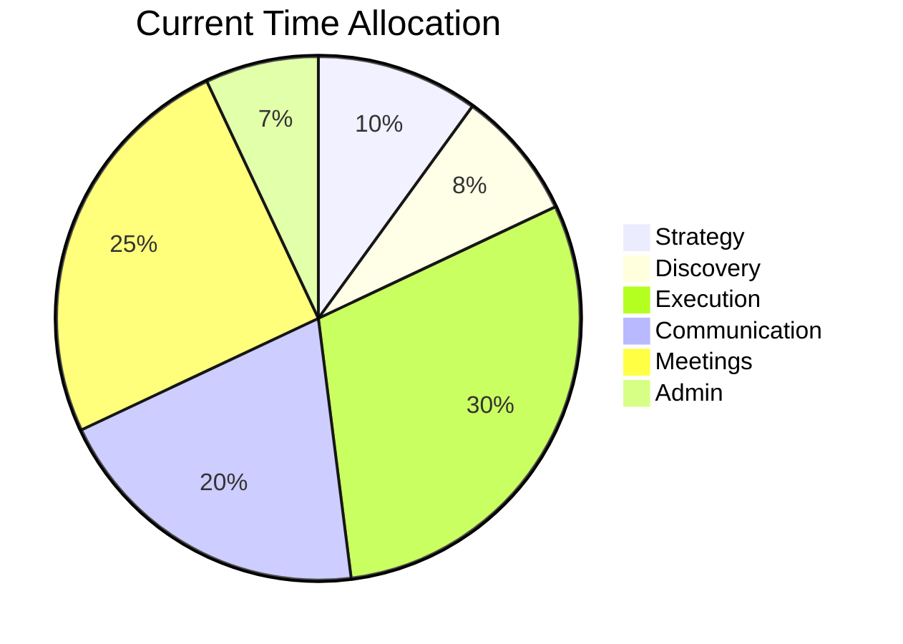

# Time Audit

## Purpose
Analyze how the PM spends their time across categories — strategy, execution, communication, meetings, and admin. Identify time sinks, misallocations relative to priorities, and opportunities for reallocation, automation, and delegation. Help the PM spend more time on high-impact activities and less on low-value busywork.

## Auto-Trigger Patterns
- "Where does my time go"
- "Time audit"
- "I'm spending too much time on…"
- "How should I allocate my time"
- "Time management for PM"
- "I'm too busy to do [important thing]"

## Inputs

**Zero-setup:** Only the user prompt is required. If context files are empty, use `context/_defaults.md` and label assumptions. See `skills/_GLOBAL-BEHAVIOR.md`.

- **Time data** (required) — PM's description of how they spend a typical week, or calendar audit data
- **Priorities** (required) — what the PM should be spending time on (strategy, discovery, delivery)
- **Calendar** (optional) — meeting schedule, recurring commitments
- **Role level** (optional) — junior PM vs senior PM vs GPM (different expected allocations)
- **Pain points** (optional) — what feels like a time waste

## Process
1. **Categorize time** into buckets:
   - **Strategy**: vision, roadmapping, market research, competitive analysis
   - **Discovery**: user research, data analysis, problem definition
   - **Execution**: sprint management, ticket writing, standups, release coordination
   - **Communication**: status updates, stakeholder meetings, presentations
   - **Meetings**: recurring ceremonies, 1:1s, ad hoc meetings
   - **Admin**: email, Slack, tool management, scheduling, expense reports
2. **Calculate current allocation** — hours per category, percentage of week
3. **Compare to ideal allocation** — based on role level and priorities
4. **Identify misallocations** — where too much or too little time is spent
5. **Diagnose time sinks** — specific activities consuming disproportionate time
6. **Recommend reallocation** — what to reduce, what to increase
7. **Identify automation and delegation candidates**

## Output Format
```markdown
# Time Audit — [PM Name] — [Date]

## Current Time Allocation
| Category | Hours/Week | % | Ideal % | Gap |
|----------|-----------|---|---------|-----|
| Strategy | 4h | 10% | 20% | -10% ⚠️ |
| Discovery | 3h | 8% | 15% | -7% ⚠️ |
| Execution | 12h | 30% | 20% | +10% |
| Communication | 8h | 20% | 20% | — |
| Meetings | 10h | 25% | 15% | +10% ⚠️ |
| Admin | 3h | 7% | 5% | +2% |

## Visualization


## Top Time Sinks
| Activity | Hours/Week | Value | Action |
|----------|-----------|-------|--------|
| Sprint ticket writing | 5h | Low | Delegate to eng lead |
| Status report writing | 3h | Medium | Automate template |

## Reallocation Plan
### Reduce (Free Up X Hours)
| Activity | Current | Target | How |
|----------|---------|--------|-----|
| [Activity] | Xh | Yh | [Approach] |

### Increase (Invest Freed Hours)
| Activity | Current | Target | Impact |
|----------|---------|--------|--------|

## Automation Opportunities
| Task | Time Spent | Automation Approach | Time Saved |
|------|-----------|-------------------|-----------|

## Delegation Candidates
| Task | Time Spent | Delegate To | Why |
|------|-----------|------------|-----|

## Meeting Audit
| Meeting | Frequency | Duration | Value | Recommendation |
|---------|-----------|----------|-------|---------------|
| [Meeting] | Weekly | 1h | Low | Reduce to biweekly |

## Implementation Plan
### Week 1: Quick Wins
### Week 2-4: Process Changes
### Month 2+: Structural Changes
```

## Quality Standards
- Categories are comprehensive — all time is accounted for
- Ideal allocation is calibrated to PM's level and current priorities
- Automation and delegation suggestions are specific and feasible
- Meeting audit questions whether each meeting needs the PM present
- **Anti-patterns**: Audit without action plan; assuming all meetings are waste; ignoring that some "low-value" tasks are relationship-building; no follow-up to check if changes stuck

## Framework References
- Eisenhower Matrix (urgent/important) for prioritization
- PM time allocation benchmarks by level (IC: more execution, Senior: more strategy)
- Deep Work (Cal Newport) for focus time protection

## Formatting Guidelines
- Current vs ideal comparison table at top
- Pie chart via Mermaid for visual allocation
- Time sinks table with specific activities, not categories
- Implementation plan as phased approach

## Example
"PM spending 30% on execution (ticket writing, sprint management) vs 10% on strategy. For a Senior PM, ideal is reversed. Top time sink: writing detailed tickets (5h/week) — delegate to eng lead with PM reviewing. Quick win: template status reports with auto-filled metrics, saving 2h/week. Freed 7h/week → invest 4h in customer discovery and 3h in competitive analysis."
