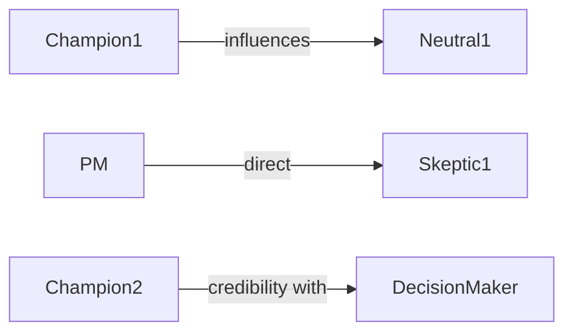

# Coalition Builder

## Purpose
For a specific decision or initiative, map the landscape of support and opposition, then design a targeted outreach strategy. Determine who to approach first, what message resonates with each person, how to leverage influence paths, and how to build a winning coalition before the formal decision point.

## Auto-Trigger Patterns
- "How do I get alignment on…"
- "Build coalition for…"
- "Who do I need to convince for…"
- "Pre-suasion strategy for…"
- "I need buy-in on…"
- "Map support for this decision"

## Inputs

**Zero-setup:** Only the user prompt is required. If context files are empty, use `context/_defaults.md` and label assumptions. See `skills/_GLOBAL-BEHAVIOR.md`.

- **Decision or initiative** (required) — what needs approval or alignment
- **Decision-maker(s)** (required) — who makes the final call
- **Stakeholder personas** (required) — `context/people/[name]/persona.md` for relevant stakeholders
- **Known positions** (optional) — who has already expressed support or opposition
- **Constraints** (optional) — timeline, political dynamics, organizational context

## Process
1. **Map the decision landscape** — who is involved, who influences the decision, who is affected
2. **Classify positions** for each stakeholder:
   - **Champion**: actively supports, will advocate
   - **Ally**: supports but won't actively advocate
   - **Neutral**: no position yet, persuadable
   - **Skeptic**: has concerns but open to persuasion
   - **Opponent**: actively opposes
3. **Analyze influence paths** — who influences whom, who can move neutrals, who can soften opponents
4. **Design outreach sequence** — approach champions first for validation, then use them to reach neutrals, address skeptics with tailored evidence, contain opponents
5. **Craft per-person messages** — frame the decision in terms each stakeholder values (from persona/influence-playbook)
6. **Plan pre-suasion** — what groundwork to lay before the formal ask (priming, social proof, reciprocity)
7. **Identify risks** — what could derail the coalition, contingency plans

## Output Format
```markdown
# Coalition Plan: [Decision/Initiative]
**Decision-maker**: … | **Target date**: … | **Current support**: X/Y

## Position Map
| Stakeholder | Position | Key Concern | Influence On |
|------------|----------|-------------|-------------|
| [Name] | Champion ✅ | — | [Who they influence] |
| [Name] | Skeptic ⚠️ | [Specific concern] | [Who they influence] |

## Influence Network


## Outreach Sequence
### Phase 1: Validate with Champions
1. **[Name]** — [channel, timing, message, ask]

### Phase 2: Engage Neutrals
2. **[Name]** — [approach, who introduces, framing]

### Phase 3: Address Skeptics
3. **[Name]** — [concern, evidence, framing, fallback]

### Phase 4: Contain Opposition
4. **[Name]** — [strategy: address concern / find compromise / work around]

## Per-Person Message Framing
### [Name]
- **They care about**: …
- **Frame as**: "…"
- **Evidence to provide**: …

## Pre-Suasion Tactics
- [Groundwork actions before formal outreach]

## Risks & Contingencies
| Risk | Likelihood | Mitigation |
|------|-----------|------------|

## Success Criteria
- [How to know the coalition is strong enough to proceed]
```

## Quality Standards
- Position classifications backed by evidence from personas and interaction logs
- Outreach sequence considers timing dependencies (who before whom)
- Messages are personalized using influence-playbook data, not generic
- Influence network diagram shows realistic paths, not aspirational ones
- **Anti-patterns**: Skipping champions and going straight to opponents; identical messages for everyone; ignoring that positions shift during the process

## Framework References
- Coalition-building strategy (sequence: validate → mobilize → address → contain)
- Cialdini's pre-suasion principles
- Stakeholder mapping quadrants for prioritization
- Influence network analysis

## Formatting Guidelines
- Position map table at top for quick orientation
- Mermaid diagram for influence network visualization
- Phased outreach with clear sequencing rationale
- Per-person message framing as ready-to-use scripts

## Example
For "Adopt new design system" initiative: "Design Lead (Champion) — validate approach in 1:1, then ask them to present to Eng Director (Neutral). Eng Director cares about velocity — frame as 'reduces front-end dev time by 30%.' VP Product (Skeptic) worries about migration cost — prepare ROI analysis showing 6-month payback. CTO (Decision-maker) trusts Eng Director's judgment — ensure Eng Director is aligned before CTO review."
