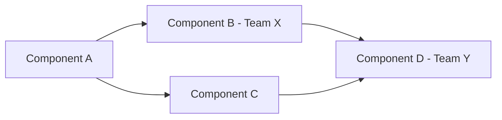

# Dependency Mapping

## Purpose
Identify, visualize, and manage cross-team and cross-system dependencies — making invisible blockers visible before they become delays. Dependency mapping turns "we didn't know we needed that from Team X" into proactive coordination and risk mitigation.

## Auto-Trigger Patterns
- "map dependencies for [initiative]"
- "what are the dependencies"
- "cross-team dependency analysis"
- "identify blockers for [project]"
- "visualize dependencies"

## Inputs

**Zero-setup:** Only the user prompt is required. If context files are empty, use `context/_defaults.md` and label assumptions. See `skills/_GLOBAL-BEHAVIOR.md`.

| Input | Required | Source |
|---|---|---|
| Initiative or feature plan | Yes | User prompt |
| Teams involved | Yes | User prompt or `context/team/team.md` |
| Timeline | Optional | User prompt |
| Technical architecture | Optional | `context/products/*/tech-context.md` |
| Existing commitments of other teams | Optional | User prompt |

## Process
1. **List all work items** — Break the initiative into components that different teams own.
2. **Identify dependencies** — For each component: what does it need from other teams/systems? What does it provide?
3. **Classify dependencies** — Blocking (can't start without it) vs. enabling (can work around temporarily).
4. **Map timelines** — When is each dependency needed? When can it be delivered? Identify gaps.
5. **Assess risks** — Which dependencies are highest risk? Single point of failure? External?
6. **Propose mitigations** — For each risky dependency: alternative approaches, interim solutions, escalation paths.
7. **Create the diagram** — Visualize the dependency graph using a Mermaid diagram.
8. **Quality-check** — All critical path dependencies identified. No circular dependencies. Mitigations are realistic.

## Output Format
```
## Dependency Map: [Initiative Name]

### Dependency Table
| # | Component | Depends On | Team | Type | Needed By | Delivery Date | Risk |
|---|-----------|-----------|------|------|-----------|---------------|------|
| 1 | [Our work] | [Their work] | [Team] | Blocking | [Date] | [Date] | High |

### Dependency Diagram


### Critical Path
[Which dependencies are on the critical path — delays here delay everything]

### Risk Assessment
| Dependency | Risk Level | Reason | Mitigation |
|-----------|-----------|--------|------------|

### Mitigation Strategies
| Strategy | Applies To | Trade-off |
|----------|-----------|-----------|

### Communication Plan
| Team | Contact | Cadence | Forum |
|------|---------|---------|-------|
```

## Quality Standards
- Every blocking dependency has a confirmed delivery date or a mitigation plan.
- Critical path is explicitly identified — the team knows what absolutely cannot slip.
- Mitigations are realistic, not theoretical ("we could build it ourselves" when you can't).
- Diagram is clear enough for stakeholders to understand.

**Anti-patterns:** Only listing technical dependencies (ignoring design, legal, data), no mitigation plans, assuming other teams will deliver on time, circular dependencies.

## Framework References
- **Critical Path Method** — Identify the longest sequence of dependent tasks.
- **RACI** — Clarify who's responsible, accountable, consulted, informed for each dependency.

## Formatting Guidelines
- Use both a table and a Mermaid diagram — table for detail, diagram for visibility.
- Color-code risk levels in the table.
- Include a communication plan for managing dependencies actively.
- Bold critical path items.

## Example
**Dependency:** "Dashboard export (our team) depends on PDF generation service (Platform team). Blocking. Needed by March 15. Platform team's current estimate: March 30. Gap: 15 days."

**Mitigation:** "Use client-side PDF generation as interim solution. Lower quality but unblocks our timeline. Swap to server-side when Platform delivers."
